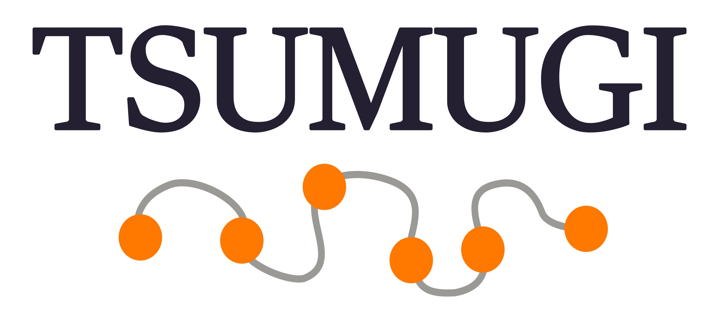

    

TSUMUGI (Trait-driven Surveillance for Mutation-based Gene module Identification) is a web tool for visualizing phenotype-driven gene networks.

The name TSUMUGI is derived from the phrase **紡ぎ**, symbolizing the concept of *twisting various things (genes) together to create one unified entity (phenotype)*.  

## IMPC Dataset

- [Release-22.0 (2024-11-04)](https://ftp.ebi.ac.uk/pub/databases/impc/all-data-releases/release-22.0/)

